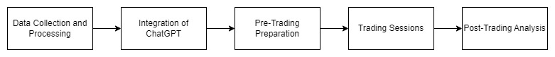

# LLM Based AI stock agent - When AI Meets Finance (StockAgent)

This project is an advanced AI-driven stock trading simulation platform that leverages Large Language Models (LLMs) to analyze financial data, simulate trading behaviors, and make informed trading decisions in simulated real-world environments.

## Table of Contents

- [Introduction](#introduction)
- [Features](#features)
- [Technologies Used](#technologies-used)
- [Project Structure](#project-structure)

## Introduction

Finance Fellas explores the intersection of AI and finance by developing a sophisticated stock trading system. The project uses LLMs to process and interpret large volumes of financial data, simulating trading scenarios that reflect real-world market conditions. The goal is to create an AI-powered stock trading agent capable of making autonomous and profitable trading decisions.

## Features

- **AI-Driven Analysis**: Utilizes LLMs for comprehensive analysis of financial data and market trends.
- **Simulated Trading Environment**: Runs simulations that mirror real-world trading conditions to test the efficacy of the AI model.
- **Performance Metrics**: Tracks and evaluates the trading performance of the AI, providing detailed insights and analytics.
- **User Interface**: A user-friendly interface for interacting with the AI model and monitoring trading activities.

## Technologies Used

- **Programming Languages**: Python
- **Machine Learning**: TensorFlow, PyTorch
- **Data Processing**: Pandas, NumPy
- **APIs**: Yahoo Finance API, Alpha Vantage API
- **Visualization**: Matplotlib, Seaborn
- **Deployment**: Docker, GitHub Actions

## Project Structure
High-level Solution: The proposed high-level solution for the LLM-based AI StockAgent involves leveraging
Large Language Models (LLMs), such as ChatGPT, to simulate investor trading behaviors based on real-world stock
market conditions. The LLMs are trained on a diverse dataset comprising financial texts, news articles, and
historical trading data. These models analyze external factors like macroeconomic indicators, policy changes,
company fundamentals, and global events to make informed trading decisions. The system creates a simulated
trading environment that replicates real-world market conditions and continuously integrates real-time data to
enhance decision-making accuracy.

Workflow/Pipeline Diagram:

The LLM-based AI StockAgent solution involves several key steps to ensure robust and informed trading decisions.
First, a diverse dataset is gathered, including historical stock data, financial news articles, macroeconomic
indicators, and real-time market data. This data is used to train Large Language Models (LLMs), such as ChatGPT,
to understand the context and make informed trading decisions. A simulated trading environment is then developed
to replicate real-world market conditions, allowing for safe testing and refinement of trading strategies. During
trading sessions, real-time data is continuously fed into the system, ensuring that the model remains responsive to
current market conditions. ChatGPT processes the input data, analyzes market conditions, and generates trading
insights. These insights are used to implement decision logic for trading agents, enabling them to execute trades
based on ChatGPT's recommendations. A mechanism is developed for agents to execute trades, updating their
portfolios and the market state accordingly. Finally, the performance of the trading strategy is evaluated using
metrics such as profit and loss, return on investment, and risk-adjusted returns, ensuring the approach is effective
and successful in real-world trading environments.

